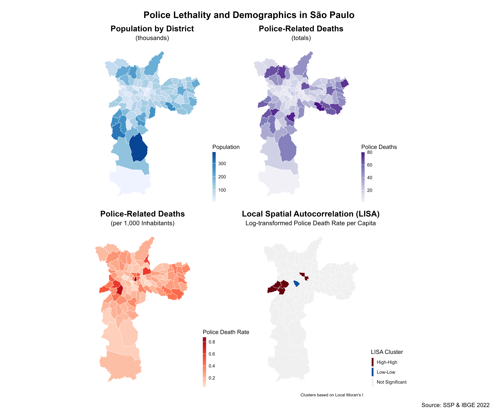

# Geospatial Analysis of Police Lethality in São Paulo

<p align="center">
  
</p>

**Authors:**  
Luis Ramirez – @lramir14 • Monserrat López – @Monlo • Rodrigo Dornelles – @rfdornelles
**Last updated:** 2025-05-12  

---

## 📝 Project Summary

Brazil’s state of São Paulo reports hundreds of police-related deaths each year, but the *where* and *why* behind those deaths remain poorly understood.  
Using 2022 census micro-data, detailed shapefiles, and incident-level police-mortality records (2013-2025), we:

1. **Geocode** individual deaths and assign them to districts.  
2. **Distribute** census population and household income down to census-sector slices that align with district borders.  
3. **Map** raw counts, per-capita death rates, and Local Indicators of Spatial Association (LISA) clusters.  
4. **Model** lethal-force risk with spatial-lag and spatial-error SAR models, testing demographic, income, and urban-form predictors.  

The full workflow is scripted in reproducible **R Markdown** (`R/PoliceKillingsFinal.Rmd`) and documented below.

---

## 📁 Repository Layout

```

├── R/                         # Helper R scripts & functions
├── R/PoliceKillingsFinal.Rmd  # Main analysis / report (this file is the source of the results)
├── data-raw/                  # Original raw data (not tracked by Git LFS)
│   ├── MortesDecorrentesIntervencaoPolicial_2025.xlsx
│   ├── SIRGAS_SHP_*           # IBGE & PMSP shapefiles (districts, census blocks, favelas …)
│   └── bq_data_income_setor_censitario.csv
├── data/                      # Clean, processed data (generated by the R markdown)
│   ├── mortes_policia_clean.rds
│   └── distritos_pop_2022.rds
├── images/                    # Analysis figures exported by R (populated by the Rmd)
│   └── overview_maps.png
├── poster/                    # Conference poster
│   ├── final_poster.pdf
│   └── final_poster.jpg
└── README.md                  # ← you are here
```

---

## ⚙️ Quick-start

1. **Clone** the repo:

   ```bash
   git clone https://github.com/rfdornelles/geospatial_assignments.git
   cd geospatial_assignments
   ```

2. **Open R** (≥ 4.2) and knit `R/PoliceKillingsFinal.Rmd`:

   ```r
   rmarkdown::render("R/PoliceKillingsFinal.Rmd")
   ```

   The first chunk automatically installs and loads all required packages:

   ```r
   c("here", "dplyr", "tidyr", "readr", "ggplot2", "sf", "lubridate",
     "viridis", "ggthemes", "spdep", "spatialreg", "patchwork",
     "janitor", "readxl", "stringr", "broom", "grid")
   ```

3. **Outputs**:  
   - Cleaned RDS files → `data/`  
   - Figures → `images/` 
   - An HTML report mirroring the Rmd → `R/PoliceKillingsFinal.html`

---

## 🗺️ Key Results

**Download full poster →** [`poster/final_poster.pdf`](poster/final_poster.pdf)

---

## 📊 Reproducing the Spatial Models

The SAR models use queen-contiguity neighbours via `spdep`:

```r
nb <- spdep::poly2nb(deaths_map)
lw <- spdep::nb2listw(nb, style = "W")
lag_model <- spatialreg::lagsarlm(
  deaths_log ~ pct_parda + pct_preta + pct_masc + avg_age +
               pct_pm + pct_favela + income_per_capita + pop_density,
  data = model_data,
  listw = lw
)
summary(lag_model)
```

See Section 6 & 7 of `R/PoliceKillingsFinal.Rmd` for full diagnostics, Moran’s I on residuals, and coefficient tables.

---

## 👩‍💻 Contribution Statement

All authors contributed equally.  
- **Modeling:** Luis Ramirez  
- **Visualization:** Monserrat López  
- **Data wrangling:** Rodrigo Dornelles  

---

## 📄 License & Citation

- Code: **MIT License** (see `LICENSE`).  
- Cite this project as:

```bibtex
@misc{ramirez2025police_lethality_sp,
  author   = {Luis Fernando Ramirez Ruiz and Monserrat López Perez and Rodrigo Dornelles},
  title    = {Geospatial Analysis of Police Lethality in São Paulo},
  year     = {2025},
  url      = {https://github.com/<your-org>/police-lethality-sp}
}
```

---

## 🙏 Acknowledgments

- **SSP-SP** for releasing incident-level lethality data.  
- **IBGE** 2022 Census team for open micro-data & shapefiles.  
- **R-Spatial** community for `sf`, `spdep`, and `spatialreg`.  

---

<sub><sup>Questions or ideas? Open an issue!</sup></sub>
